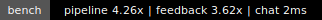

# Watcher


[](https://securityscorecards.dev/viewer/?uri=github.com/francis18georges-png/Watcher)

Atelier local d'IA de programmation autonome (offline par défaut).
Mémoire vectorielle, curriculum adaptatif, A/B + bench et quality gate sécurité.

## Version

Le dépôt contient des workflows et des scripts de packaging, mais il ne faut pas en déduire qu'une distribution publique est disponible en continu.

- **Releases publiques** : à considérer comme indisponibles tant qu'aucun tag publié ne contient réellement des artefacts téléchargeables.
- **Artefacts maintenus dans le dépôt** : le code source, la configuration, les scripts, la documentation versionnée et les métriques locales.
- **Artefacts potentiels** : wheels, archives packagées, SBOM ou bundles de signature, seulement lorsqu'une release effective a été créée et vérifiée.

- 🗒️ Notes complètes : voir le [CHANGELOG](CHANGELOG.md) et la [page de notes de version](docs/release_notes.md).
- ✅ Les procédures de vérification ci-dessous décrivent la cible de packaging ; elles ne valent que lorsqu'un artefact public existe réellement.

## Démarrage hors ligne en 3 étapes

1. **Préparer un environnement Python local** (environnement virtuel recommandé) :

   ```bash
   python -m venv .venv
   source .venv/bin/activate  # Linux/macOS
   .venv\Scripts\activate     # Windows
   pip install -r requirements.txt
   pip install -e .
   ```

2. **Initialiser votre espace utilisateur (`~/.watcher`)** :

   ```bash
   watcher init --fully-auto
   ```

   La commande détecte le matériel disponible (CPU/GPU), prépare un `config.toml`
   et une `policy.yaml` dans `~/.watcher/`, télécharge ou copie les modèles locaux
   requis dans `~/.watcher/models/`, puis active le mode offline par défaut.
   Les valeurs par défaut documentées sont publiées dans [`config/policy.yaml`](config/policy.yaml)
   afin que les installeurs et kits hors-ligne puissent embarquer le même référentiel
   sans exécuter la CLI.
   Les chemins générés pointent vers `~/.watcher/models/` afin de séparer les données
   utilisateur du dépôt Git. Le script `scripts/setup-local-models.sh` reste utile
   pour pré-provisionner les artefacts sur Linux/macOS, mais il n'est plus requis
   pour le bootstrap standard.

3. **Lancer l'agent entièrement offline** :

   ```bash
   watcher run --offline --prompt "Analyse ce dépôt et résume les modules principaux."
   ```

   La commande appelle le backend `llama.cpp` local, la mémoire vectorielle SQLite et les
   outils sandboxés (`app/core/sandbox.py`). Les traces sont visibles dans `~/.watcher/logs/`.

   Pour vérifier ce parcours dans un environnement vierge, la recette `make demo-offline`
   prépare automatiquement un espace isolé dans `.artifacts/demo-offline/` avant de lancer
   `watcher run --offline`.

### Commandes CLI stables

- `watcher init --fully-auto` : crée `~/.watcher/config.toml`, une politique par
  défaut, un journal de consentement et les modèles locaux de référence sans interaction.
- `watcher run` : exécute un scénario minimaliste (prompt libre) en respectant le mode
  offline. Le drapeau `--model` permet de basculer dynamiquement vers un autre fichier GGUF.
- `watcher ask "question"` : interroge l'index vectoriel local (namespace configurable) et
  renvoie une réponse déterministe, y compris sans réseau grâce au fallback `Echo`.
- `watcher ingest chemin/` : ajoute un ou plusieurs fichiers Markdown/TXT dans la mémoire
  vectorielle persistée (`memory/vector-store.db`) en lots contrôlés via `--batch-size`.
- `watcher policy approve --domain <domaine> --scope web|git` : persiste une règle de policy
  dans `~/.watcher/policy.yaml` sous `domain_rules`. `allowlist_domains` reste synchronisé
  pour compatibilité avec les garde-fous runtime existants.
- `watcher autopilot run --noninteractive` : exécute un cycle supervisé `discover → scrape → verify → ingest`
  sous contrôle de la policy runtime.

## Citer Watcher

Merci de citer ce dépôt lorsque vous réutilisez son code, ses jeux de données ou sa
documentation. Les métadonnées officielles de citation sont fournies dans
[`CITATION.cff`](CITATION.cff) et peuvent être exportées dans différents formats à
l'aide de [`cffconvert`](https://github.com/citation-file-format/cff-converter-python) :

```bash
pip install cffconvert
cffconvert --validate --format bibtex --outfile watcher.bib
```

## Documentation

La documentation source est maintenue dans `docs/` et peut être construite localement avec MkDocs.
Le dépôt contient un workflow [`deploy-docs.yml`](.github/workflows/deploy-docs.yml), mais il ne faut pas présenter GitHub Pages comme une surface publique garantie tant qu'une page effectivement accessible n'est pas vérifiée.

Pour la prévisualiser localement :

```bash
pip install -r requirements-dev.txt
mkdocs serve
```

Le workflow GitHub Actions [`deploy-docs.yml`](.github/workflows/deploy-docs.yml) construit le site avec `mkdocs build --strict`.
Si GitHub Pages n'est pas activé ou accessible, la source de vérité reste la documentation versionnée dans ce dépôt.

## Sécurité et qualité automatisées

Le badge OpenSSF Scorecard reflète en continu l'état de la posture de sécurité du dépôt
(`.github/workflows/scorecard.yml`). Il est généré à partir de l'API publique
<https://api.securityscorecards.dev/projects/github.com/francis18georges-png/Watcher> et renvoie vers le
rapport détaillé sur <https://securityscorecards.dev>. Un run planifié hebdomadaire publie les
résultats sur le tableau de bord OpenSSF, tandis que chaque Pull Request bénéficie d'une analyse
à jour dans GitHub Actions.

La CI inclut désormais un garde-fou `Scorecard gate` dans [`ci.yml`](.github/workflows/ci.yml)
qui rejoue l'analyse Scorecard à chaque Pull Request. Le job échoue si le score global
redescend sous `7`, empêchant ainsi le reste du pipeline et la fusion tant que les bonnes
pratiques identifiées par Scorecard ne sont pas rétablies.

La matrice Python du même workflow est résolue par le job `determine-python`. En l'absence
de variable `WATCHER_NOX_PYTHON`, il publie explicitement la version de référence (`3.12`)
afin que les jobs `quality` puissent s'exécuter sur Linux, macOS et Windows avec le même
interpréteur que les workflows de release. Pour cibler un autre interpréteur ou étendre
temporairement la matrice (par exemple `3.13`), exportez
`WATCHER_NOX_PYTHON="3.13"` (ou plusieurs valeurs séparées par des virgules) avant
de lancer `nox` ou de déclencher le workflow manuellement ; la même logique s'applique aux
exécutions locales via `noxfile.py`.

## Releases, SBOM et provenance

Le dépôt contient un workflow [`release.yml`](.github/workflows/release.yml) et des instructions de vérification d'artefacts.
Cela décrit une **capacité de packaging** du dépôt, pas une promesse qu'une release publique est actuellement disponible.

### Artefacts publiés

Quand une release publique est réellement créée, elle peut inclure une partie des artefacts suivants selon l'état des workflows et de l'infrastructure :

| Fichier (ou motif) | Description |
| --- | --- |
| `watcher-linux-x86_64.tar.gz` | Archive exécutable Linux (PyInstaller). |
| `watcher-windows-x86_64.zip` | Archive exécutable Windows (PyInstaller). |
| `watcher-macos-x86_64.dmg`, `watcher-macos-arm64.dmg` | Images disque macOS. |
| `watcher-<version>.msi`, `watcher-<version>.msix` | Installeurs Windows générés par `scripts/package_windows.py`. |
| `watcher-linux.AppImage`, `watcher_<version>_amd64.deb`, `watcher-<version>-1.x86_64.rpm`, `watcher-<version>.flatpak` | Artefacts Linux générés par `scripts/package_linux.py`. |
| `watcher-*.whl`, `watcher-*.tar.gz` | Paquets Python (wheel + sdist), ensuite publiés sur PyPI. |
| `watcher-*-sbom.json` | SBOM CycloneDX par plateforme de build. |
| `checksums.txt`, `checksums.txt.sig`, `checksums.slsa.intoto.jsonl` | Intégrité signée + provenance SLSA du lot de release. |

### Vérifier les artefacts publiés

Cette section ne s'applique que si une release publique contient effectivement les fichiers mentionnés.

Validez l'authenticité et l'intégrité des artefacts téléchargés pour un tag donné :

```bash
# 1. Télécharger les artefacts critiques (binaire + checksums + provenance)
RELEASE="https://github.com/francis18georges-png/Watcher/releases/download/<VERSION>"
wget "$RELEASE/watcher-windows-x86_64.zip" \
     "$RELEASE/checksums.txt" \
     "$RELEASE/checksums.txt.sig" \
     "$RELEASE/checksums.slsa.intoto.jsonl"

# 2. Vérifier la signature Sigstore du manifeste global
cosign verify-blob \
  --bundle checksums.txt.sig \
  --certificate-identity "https://github.com/francis18georges-png/Watcher/.github/workflows/release.yml@refs/tags/<VERSION>" \
  --certificate-oidc-issuer https://token.actions.githubusercontent.com \
  checksums.txt

# 3. Vérifier la provenance SLSA (attestation supply chain)
cosign verify-attestation \
  --type slsaprovenance \
  --bundle checksums.slsa.intoto.jsonl \
  --certificate-identity "https://github.com/francis18georges-png/Watcher/.github/workflows/release.yml@refs/tags/<VERSION>" \
  --certificate-oidc-issuer https://token.actions.githubusercontent.com \
  checksums.txt

# 4. Calculer/valider les empreintes locales
sha256sum watcher-windows-x86_64.zip watcher-linux-x86_64.tar.gz watcher-macos-arm64.dmg
```

- Remplacez `<VERSION>` par le tag SemVer effectivement publié (ex. `v0.5.0`).
- Pour Linux/macOS, comparez le `sha256sum` obtenu avec les empreintes publiées dans la release.
- Les SBOM (`Watcher-*-sbom.json`) peuvent être explorés avec `jq`, importés dans un scanner CycloneDX ou
  validés via `cyclonedx-py validate Watcher-sbom.json`.
- Les distributions Python (`watcher-*.whl`, `watcher-*.tar.gz`) sont signées par la provenance GitHub
  (workflow `release.yml`) et peuvent être installées via `pip install watcher-*.whl` après vérification des
  `sha256sum`.

Ces fichiers sont publiés en tant qu'artefacts de release. Téléchargez le SBOM correspondant pour auditer les composants de la
plateforme visée et conservez la provenance `*.intoto.jsonl` pour tracer la chaîne de build ou alimenter un vérificateur SLSA.

### Installer sur Windows

1. Téléchargez `watcher-windows-x86_64.zip` (et le manifeste `checksums.txt`) depuis la page GitHub Releases
   correspondant au tag SemVer (`vMAJOR.MINOR.PATCH`) que vous souhaitez déployer.
2. Installez le CLI [Sigstore](https://www.sigstore.dev/) si nécessaire :

   ```bash
   pip install sigstore
   ```

3. Vérifiez la signature à l'aide du bundle publié par le workflow `release.yml` :

   ```powershell
   sigstore verify identity `
     --bundle checksums.txt.sig `
     --certificate-identity "https://github.com/francis18georges-png/Watcher/.github/workflows/release.yml@refs/tags/<tag>" `
     --certificate-oidc-issuer https://token.actions.githubusercontent.com `
     checksums.txt
   ```

   Remplacez `<tag>` par la version téléchargée. Si vous validez un fork, adaptez l'identité du certificat pour refléter votre dépôt ; pour la distribution officielle, l'identité doit rester `https://github.com/francis18georges-png/Watcher/.github/workflows/release.yml@refs/tags/<tag>`.
   La commande échoue si la signature ne provient pas du workflow officiel exécuté sur GitHub Actions.
4. Extrayez l'archive (clic droit → *Extraire tout...* ou `Expand-Archive` sous PowerShell) puis lancez `Watcher.exe`.
   Conservez le dossier d'extraction tel quel : il contient la configuration (`config/`), les prompts LLM et les fichiers
   auxiliaires (`LICENSE`, `example.env`) nécessaires à l'exécutable.

Le bundle Sigstore fournit également un horodatage de transparence et peut être vérifié hors-ligne grâce au
[`rekor-cli`](https://github.com/sigstore/rekor) si vous devez archiver la preuve de signature.

### Installer sur Linux

1. Téléchargez `watcher-linux-x86_64.tar.gz` depuis la page GitHub Releases correspondant à la version désirée.
2. Extrayez l'archive dans un répertoire dédié :

   ```bash
   tar -xzf watcher-linux-x86_64.tar.gz
   ```

3. Exécutez le binaire depuis le dossier extrait :

   ```bash
   cd Watcher
   ./Watcher --help
   ```

   Le bundle contient la configuration et les prompts requis. Vous pouvez déplacer le dossier complet vers un emplacement
   inclus dans votre `PATH` ou créer un lien symbolique vers `Watcher`.

### Installer sur macOS

1. Téléchargez `watcher-macos-x86_64.dmg` ou `watcher-macos-arm64.dmg` depuis la page GitHub Releases.
2. Montez l'image disque (`open watcher-macos-x86_64.dmg`) puis copiez l'application dans un dossier local (par ex. `~/Applications/Watcher/`).
3. Si un certificat de signature est configuré, le binaire est signé et le workflow soumet automatiquement l'archive à la
   notarisation Apple à l'aide de `notarytool`. Vous pouvez vérifier l'intégrité locale :

   ```bash
   codesign --verify --deep --strict Watcher/Watcher
   ```

   et afficher le ticket de notarisation (si disponible) via l'artefact de workflow `Watcher-macos-notarization.json` ou en interrogeant
   `xcrun notarytool history --apple-id <id> --team-id <team> --password <app-specific-password>`.
4. Lancez l'exécutable depuis le Terminal :

   ```bash
   cd Watcher
   ./Watcher --help
   ```

   Conservez l'ensemble du dossier, qui regroupe la configuration et les prompts nécessaires. Si aucun certificat n'est fourni,
   macOS affichera un avertissement Gatekeeper ; autorisez l'exécution via *Préférences système → Sécurité et confidentialité*.

## Benchmarks

Le script `python -m app.core.benchmark run` exécute quatre scénarios
représentatifs en mesurant le temps et l'utilisation mémoire via `tracemalloc` :

- `planner_briefing` : génère des briefs successifs avec le planificateur.
- `learner_update` : applique plusieurs mises à jour du `Learner`.
- `metrics_tracking` : exerce les context managers de `PerformanceMetrics`.
- `memory_operations` : manipule la base SQLite de `Memory` (ajout, résumé,
  feedback et recherche vectorielle).

Chaque exécution ajoute une entrée historique dans `metrics/benchmarks.jsonl`,
met à jour le résumé courant dans `metrics/benchmarks-latest.json` et régénère
le badge `metrics/performance_badge.svg`.

Les seuils de non-régression sont définis dans `metrics/bench_thresholds.json`.
Pour vérifier qu'ils sont respectés, utilisez :

```bash
python -m app.core.benchmark run --samples 5 --warmup 1
python -m app.core.benchmark check --update-badge
```

La CI (`ci.yml`) exécute automatiquement ces commandes et échoue si un scénario
dépasse l'un des seuils configurés.

## Gestion des données avec DVC

Watcher versionne ses jeux de données légers avec [DVC](https://dvc.org/).
Installez l'outil (par exemple `pip install "dvc[s3]"`) avant d'exécuter les commandes ci-dessous.

- L'étape `prepare-data` lit `datasets/raw/simple_linear.csv` et génère
  `datasets/processed/simple_linear.csv` en appliquant les hyperparamètres
  définis dans `params.yaml` (`prepare.sample_size`, `prepare.random_seed`).
- L'étape `validate-data` exécute trois scripts (`scripts/validate_schema.py`,
  `scripts/validate_size.py`, `scripts/validate_hash.py`) pour vérifier la
  structure, la taille et l'empreinte MD5 du fichier préparé. Les attentes sont
  décrites dans la section `validate.simple_linear` de `params.yaml`.

Pour régénérer et valider les données locales :

```bash
dvc repro
```

Le dépôt est configuré avec un remote S3 `storage` pointant vers
`s3://watcher-artifacts` (voir `.dvc/config`). Pour publier ou récupérer les
artefacts :

1. Configurer vos identifiants AWS via `aws configure` ou en définissant les
   variables d'environnement `AWS_ACCESS_KEY_ID`, `AWS_SECRET_ACCESS_KEY` et
   `AWS_DEFAULT_REGION`.
2. Initialiser la cible par défaut si nécessaire :

   ```bash
   dvc remote default storage
   ```

3. Synchroniser les données :

   ```bash
   dvc push   # envoie les artefacts locaux vers S3
   dvc pull   # récupère les artefacts manquants depuis S3
   ```

Si vous devez utiliser un autre fournisseur (Azure Blob Storage, Google Cloud,
etc.), ajustez l'URL du remote via `dvc remote modify storage url <nouvelle-url>`
et mettez à jour la configuration d'authentification associée.

## Installation

1. Cloner ce dépôt.
2. Créer et activer un environnement Python 3.12 ou supérieur :

   ```bash
   python -m venv .venv
   source .venv/bin/activate  # Linux/macOS
   .venv\Scripts\activate   # Windows
   ```

3. Installer les dépendances :

   ```bash
   pip install -r requirements.txt
   ```

   Pour activer les quotas d'exécution sur Windows, installez
   également la dépendance optionnelle `pywin32` :

   ```bash
   pip install pywin32  # facultatif
   ```

4. Installer les outils de développement :

    ```bash
    pip install -r requirements-dev.txt
    ```

    Ce fichier fixe des versions précises afin d'assurer une installation reproductible.

    Sur Windows, le script [`installer.ps1`](installer.ps1) crée `.venv`, installe
    `requirements.txt`, `requirements-dev.txt` puis le package `watcher` en mode editable.
    Utilisez `-SkipDevDependencies` pour une installation plus légère et `-Initialize`
    pour enchaîner immédiatement avec `watcher init --fully-auto`.

Les fichiers d'environnement (`*.env`), les journaux (`*.log`) et les environnements virtuels (`.venv/`) sont ignorés par Git afin d'éviter la mise en version de données sensibles ou temporaires.

## Exécution via Docker

Le dépôt contient un workflow [`docker.yml`](.github/workflows/docker.yml) pour construire une image container.
Ne considérez pas l'image comme publiquement disponible tant qu'un tag ou un package GHCR vérifiable n'est pas présent.

### Utiliser l'image publiée

Les points de montage suivants permettent de persister les fichiers générés par Watcher entre deux
exécutions :

- `/app/data` : base de données principale (`WATCHER_DATABASE__URL`).
- `/app/memory` : cache vectoriel et fichiers de mémoire (`memory/mem.db`).
- `/app/logs` : journaux d'exécution.
- `/app/config` *(optionnel)* : configuration TOML et fichiers `plugins.toml` personnalisés.

```bash
docker run --rm -it \
  -v watcher-data:/app/data \
  -v watcher-memory:/app/memory \
  -v watcher-logs:/app/logs \
  ghcr.io/francis18georges-png/watcher:latest --help
```

Copiez le dossier `config/` du dépôt si vous souhaitez le personnaliser avant de le monter en lecture
(`-v "$(pwd)/config:/app/config:ro"`).  Les variables d'environnement peuvent être fournies avec
`--env-file` (par exemple `--env-file ./example.env`).

Pour exécuter une commande CLI, passez-la directement après l'image :

```bash
docker run --rm -it ghcr.io/francis18georges-png/watcher:latest plugin list
```

### Vérifier les artefacts de signature, de provenance et les SBOM

Le workflow [`docker.yml`](.github/workflows/docker.yml) publie, en plus de l'image container,
les artefacts suivants pour chaque exécution :

- `cosign-bundles/ghcr.io__francis18georges-png__watcher__<tag>.sigstore` : bundle Sigstore de la signature
  keyless pour la référence `ghcr.io/francis18georges-png/watcher:<tag>`.
- `watcher-image-provenance/watcher-image.intoto.jsonl` : attestation SLSA générée via
  [`slsa-github-generator`](https://github.com/slsa-framework/slsa-github-generator) et liée au digest
  publié par le job `Build and publish image`.
- `watcher-image-sbom.cdx.json` : SBOM CycloneDX généré avec `syft`, téléchargeable depuis
  l'artefact `watcher-image-sbom` ou joint à la release correspondante.
- `watcher-image-sbom-spdx/sbom.spdx.json` : SBOM SPDX JSON produit par `syft` pour répondre aux
  exigences de conformité des registres et scanners.

Les caractères `/` et `:` du nom d'image sont remplacés par `__` pour garantir des noms de fichiers
compatibles avec GitHub Actions. Téléchargez l'image, le bundle Sigstore, l'attestation et les SBOM
correspondants au tag SemVer souhaité (`vMAJOR.MINOR.PATCH`), puis vérifiez la signature hors-ligne
avec `cosign` :

```bash
cosign verify \
  --bundle ghcr.io__francis18georges-png__watcher__<tag>.sigstore \
  --certificate-identity "https://github.com/francis18georges-png/Watcher/.github/workflows/docker.yml@refs/tags/<tag>" \
  --certificate-oidc-issuer https://token.actions.githubusercontent.com \
  ghcr.io/francis18georges-png/watcher@sha256:<digest>
```

Remplacez `<tag>` par la version téléchargée (par exemple `v0.4.0`) et `<digest>` par l'empreinte
SHA256 de l'image. Vous pouvez récupérer ce digest via `docker buildx imagetools inspect`
(`docker buildx imagetools inspect ghcr.io/francis18georges-png/watcher:<tag> --format '{{.Digest}}'`).

Pour les images construites depuis `main`, remplacez l'identité du certificat par
`https://github.com/francis18georges-png/Watcher/.github/workflows/docker.yml@refs/heads/main` et utilisez le
digest correspondant (affiché par `docker pull` ou `crane digest`).

L'attestation SLSA permet de relier cryptographiquement ce digest au workflow GitHub Actions.
Téléchargez l'artefact `watcher-image-provenance` puis vérifiez-le avec
[`slsa-verifier`](https://github.com/slsa-framework/slsa-verifier) :

```bash
slsa-verifier verify-image \
  --provenance watcher-image.intoto.jsonl \
  ghcr.io/francis18georges-png/watcher@sha256:<digest>
```

Vous pouvez également inspecter le fichier pour contrôler manuellement les champs `builder.id` et
`buildDefinition.resolvedDependencies` :

```bash
jq '{subject, buildType: .predicate.buildType, builder: .predicate.builder.id}' \
  watcher-image.intoto.jsonl
```

Enfin, examinez les deux SBOM fournis :

```bash
jq '.components[] | {name, version}' watcher-image-sbom.cdx.json | head
jq '.packages[] | {name, versionInfo}' sbom.spdx.json | head
```

Le format CycloneDX reste adapté aux scanners `grype`/`trivy`, tandis que le SBOM SPDX JSON peut être
importé dans des solutions de gouvernance qui n'acceptent que le schéma SPDX 2.3.

### Construire l'image en local

Si vous ne souhaitez pas attendre la publication GitHub Actions, construisez et testez l'image avec Docker :

```bash
docker build -t watcher:local .
docker run --rm -it watcher:local mode offline
```

Les volumes présentés ci-dessus fonctionnent également avec l'image locale (`watcher:local`).

## Environnement de développement

Un dossier `.devcontainer/` est fourni pour disposer d'un environnement prêt à l'emploi
dans VS Code ou GitHub Codespaces. Il utilise l'image Python 3.12 officielle
(alignée sur la version minimale supportée par le projet), préconfigure les caches
`pip` et `DVC` sur des volumes persistants et installe automatiquement les
dépendances du projet ainsi que les hooks `pre-commit`.

Pour ouvrir le projet dans un devcontainer :

1. Installer l'extension [Dev Containers](https://marketplace.visualstudio.com/items?itemName=ms-vscode-remote.remote-containers).
2. Dans VS Code, exécuter la commande **Dev Containers: Reopen in Container**.
3. Attendre la fin du script `.devcontainer/post-create.sh` qui prépare l'environnement.

Les caches partagés accélèrent notamment les installations pip et la synchronisation DVC
entre plusieurs sessions Codespaces.

## Compatibilité NumPy

Watcher tente d'utiliser la bibliothèque `numpy` lorsqu'elle est disponible.
Si son import échoue, un module de repli léger `numpy_stub` est utilisé à la
place. Les modules Python importent donc `np` via `from app.utils import np`
pour bénéficier automatiquement de ce mécanisme.

## Mémoire et migrations

Le module `Memory` s'appuie sur SQLite et exécute automatiquement les
migrations [Alembic](https://alembic.sqlalchemy.org/) au démarrage pour garantir
la présence du schéma attendu. Chaque connexion active `journal_mode=WAL`,
`foreign_keys=ON`, `busy_timeout=5000`, `secure_delete=ON` et tente d'exposer
FTS5 lorsque la compilation de SQLite le permet.

### Activer le chiffrement SQLCipher

Watcher détecte automatiquement la prise en charge de
[SQLCipher](https://www.zetetic.net/sqlcipher/). Lorsque le binaire `sqlite3`
est compilé avec cette extension, vous pouvez chiffrer la base mémoire en
définissant les variables d'environnement suivantes avant de lancer
l'application :

```bash
export WATCHER_MEMORY_ENABLE_SQLCIPHER=1
export WATCHER_MEMORY_SQLCIPHER_PASSWORD="motdepasse-solide"
```

Si SQLCipher n'est pas détecté ou si le mot de passe est absent, Watcher
revient automatiquement à un stockage non chiffré et inscrit un avertissement
dans les journaux pour faciliter le diagnostic.

## Utilisation

### Interface graphique

Sous Windows :

1. `./installer.ps1` pour créer l'environnement local et installer la CLI.
   Ajoutez `-Initialize` si vous voulez lancer `watcher init --fully-auto` dans la foulée.
2. Si vous n'avez pas utilisé `-Initialize`, exécutez `.\.venv\Scripts\watcher.exe init --fully-auto`.
3. `./run.ps1`

Dans un environnement sans serveur d'affichage (CI, sessions distantes), forcez le mode headless en vidant `DISPLAY`
avant d'exécuter le lanceur :

```powershell
$env:DISPLAY = ""
./run.ps1
```

### Ligne de commande

```bash
watcher --help
# ou, sans installation editable :
python -m app.cli --help
```

### Générer une CLI Python

Un utilitaire `create_python_cli` (dans `app.tools.scaffold`) permet de
générer un squelette de projet sous `app/projects/<nom>`. Passer
`force=True` écrase les fichiers existants sans demande de confirmation.

## Plugins

Watcher peut être étendu par des plugins implémentant l'interface
`Plugin` définie dans `app/tools/plugins`. Chaque plugin expose un
attribut `name` ainsi qu'une méthode `run()` retournant un message à
l'utilisateur.

Deux mécanismes de découverte sont supportés :

- déclaration explicite dans le fichier `plugins.toml` ;
- [entry points](https://packaging.python.org/en/latest/specifications/entry-points/)
  Python via le groupe `watcher.plugins` recherchés par
  `discover_entry_point_plugins()`.

Pour enregistrer un plugin via les entry points dans un projet
emballé, ajoutez par exemple dans votre `pyproject.toml` :

```toml
[project.entry-points."watcher.plugins"]
hello = "monpaquet.monmodule:MonPlugin"
```

Un exemple minimal est fourni dans `app/tools/plugins/hello.py`.

## Tests & Qualité

Watcher s'appuie désormais sur [Nox](https://nox.thea.codes/) pour unifier les
linters, l'analyse statique, les tests et la construction du package :

```bash
nox -s lint typecheck security tests
```

Les sessions peuvent également être exécutées individuellement (`nox -s lint`,
`nox -s tests`, etc.) et une étape `nox -s build` génère les artefacts wheel et
sdist.

Pour automatiser les corrections, la cible `make format` applique Ruff (lint
et formattage) puis Black, et `make check` délègue dorénavant à Nox.

### Hooks pre-commit

Le dépôt inclut une configuration `pre-commit` regroupant les hooks suivants :

* Ruff (`ruff` et `ruff-format`) pour le linting et le formatage.
* Black pour garantir un style Python cohérent.
* mypy (avec `types-requests`) pour la vérification de types statique.
* Bandit pour l'analyse de sécurité.
* Semgrep basé sur `config/semgrep.yml`.
* Codespell pour détecter les fautes de frappe courantes.
* `end-of-file-fixer` qui s'assure que chaque fichier texte se termine par une
  nouvelle ligne.
Après avoir installé les dépendances de
développement, activez les hooks localement :

```bash
pre-commit install
```

Vous pouvez ensuite valider l'ensemble des fichiers :

```bash
pre-commit run --all-files
```

La configuration `bandit.yml` exclut notamment les répertoires `.git`, `datasets`,
`.venv`, `build`, `dist` et `*.egg-info` afin d'éviter l'analyse de contenus
non pertinents.

## Gouvernance des contributions

Les attentes pour les contributeurs et les canaux d'escalade sont décrites dans le [Code de conduite](CODE_OF_CONDUCT.md).
Pour préparer votre environnement, exécuter les scripts nécessaires (Nox, DVC, benchmarks) et comprendre la politique de
review/merge, consultez le guide [CONTRIBUTING.md](CONTRIBUTING.md).

- Les formulaires présents dans `.github/ISSUE_TEMPLATE/` ajoutent
  systématiquement `status:needs-triage` ainsi qu'un label `type:*`
  (`type:bug`, `type:feature`, `type:discussion`).
- Le fichier `.github/CODEOWNERS` assigne les revues aux équipes responsables.
  Adaptez les alias (`@WatcherOrg/...`) à votre organisation GitHub.
- Avant toute fusion, assurez-vous que `nox -s lint typecheck security tests
  build` est vert sur la CI et qu'au moins un CODEOWNER a approuvé la PR. Un
  mainteneur peut ensuite poser `status:ready-to-merge` qui déclenchera la
  fusion automatique.

Pour plus de détails (priorités, gestion du label `blocked`, etc.), consultez
`docs/merge-policy.md`.

## Reproductibilité

Un utilitaire `set_seed` permet de fixer la graine aléatoire pour Python,
NumPy et, si disponible, PyTorch. Le fichier de configuration
`config/settings.toml` contient un paramètre `seed` dans la section `[training]`
qui peut être adapté pour garantir des exécutions déterministes.

La commande CLI `watcher` lit cette graine au démarrage (ou l'option
`--seed`) puis appelle `set_seed` avant de déléguer aux sous-commandes.
Cela initialise toutes les bibliothèques stochastiques et met à jour les
variables d'environnement `PYTHONHASHSEED` et `WATCHER_TRAINING__SEED` pour que
les sous-processus héritent de la configuration.

La chaîne d'outils reproduit le même comportement :

- la CI exporte `PYTHONHASHSEED=42`, `WATCHER_TRAINING__SEED=42`,
  `CUBLAS_WORKSPACE_CONFIG=:4096:8` et `TORCH_DETERMINISTIC=1` ;
- le `Makefile` et le script PowerShell `run.ps1` propagent ces variables
  (avec une graine configurable via `SEED`/`WATCHER_TRAINING__SEED`).

Pour vos exécutions locales, vous pouvez soit utiliser le `Makefile`
(`make check`, `make nox`, …), soit exporter explicitement les variables
précitées avant de lancer vos scripts afin d'aligner l'environnement avec
la configuration versionnée.

## Données

La pipeline [DVC](https://dvc.org/) décrite dans `dvc.yaml` prépare et valide le
jeu de données linéaire utilisé par `train.py` :

- `prepare-data` lit `datasets/raw/simple_linear.csv`, applique les paramètres
  définis dans `params.yaml` (graine, taille d'échantillon) et génère
  `datasets/processed/simple_linear.csv`.
- `validate-data` utilise `foreach` pour produire trois sous-étapes
  (`validate-data@schema`, `validate-data@size`, `validate-data@hash`).
  Chacune exécute un script dédié dans `scripts/validate_*.py` pour
  vérifier respectivement le schéma, la taille et le hachage du fichier
  produit.

Les hyperparamètres d'entraînement ainsi que les contraintes de validation sont
centralisés dans `params.yaml` (syntaxe JSON valide YAML pour éviter d'ajouter
une dépendance d'analyse). Pour exécuter la pipeline complète et garantir
que les validations passent, lancez :

```bash
dvc repro validate-data
```

Un remote S3 nommé `storage` est configuré dans `.dvc/config` (URL
`s3://watcher-artifacts`). Renseignez vos identifiants AWS via les variables
d'environnement standard (`AWS_ACCESS_KEY_ID`, `AWS_SECRET_ACCESS_KEY`,
éventuellement `AWS_SESSION_TOKEN` ou `AWS_PROFILE`) puis synchronisez les
artefacts DVC avec :

```bash
# envoyer les données préparées sur le bucket
dvc push
# récupérer les dernières versions depuis le stockage
dvc pull
```

Vous pouvez remplacer le bucket par un autre en adaptant la configuration du
remote :

```bash
dvc remote modify storage url s3://votre-bucket
```

Pour cibler un autre fournisseur, créez un remote dédié et rendez-le
par défaut. Exemple avec Azure Blob Storage :

```bash
dvc remote add -d azure azure://mon-container/datasets
dvc remote modify azure connection_string "DefaultEndpointsProtocol=..."
```

Consultez la [documentation DVC](https://dvc.org/doc/command-reference/remote)
pour les paramètres spécifiques (S3, Azure, GCS, etc.).

### Collecte

Un module de scraping asynchrone (`app/data/scraper.py`) permet de
collecter des pages web en parallèle tout en les mettant en cache sur
disque. Les téléchargements déjà effectués ne sont pas relancés, ce qui
accélère les itérations et facilite la reprise après interruption.

## Structure du dépôt

- `app/` : moteur principal, mémoire, benchmarks et interface utilisateur.
- `datasets/` : jeux d'entraînement Python (`fib`, `fizzbuzz`, `is_prime`).
- `config/` : paramètres et règles de sécurité (`semgrep`).

## Surface publique actuelle

La surface publique décrite honnêtement aujourd'hui est la suivante :

- le code source du dépôt ;
- la CLI Python et les scripts locaux ;
- la documentation versionnée dans `docs/` ;
- les workflows CI/CD comme éléments d'infrastructure versionnés.

Ne doivent pas être présentés comme garantis sans vérification :

- GitHub Pages publique ;
- GitHub Releases téléchargeables ;
- images Docker publiées ;
- artefacts signés/SBOM accessibles au public.

## Slice Phase 1

Le dépôt inclut maintenant une base minimale pour la Phase 1 de la roadmap documentaire contrôlée :

- un **Source Registry** explicite, stocké localement en JSON ;
- trois états de connaissance réels dans le code : `raw`, `validated`, `promoted` ;
- des métadonnées minimales de traçabilité : source, type, langue, confiance, fraîcheur/date, licence, statut, motifs de validation/promotion, résultat d’évaluation (`promoted` ou `rejected`), score d’évaluation, comptage de corroboration, ainsi que des traceurs HTTP quand ils existent (`etag`, `last_modified`, `fetched_at`).

Cette base reste volontairement incrémentale : elle s'appuie sur la chaîne existante `autopilot -> scrapers -> evaluate -> ingest -> embeddings`, sans introduire de collecte web générale ni de boucle d'auto-amélioration.

## GitHub ciblé

Le support GitHub reste strictement ciblé et justifié :

- **Supporté** : métadonnées de dépôt, dernière release, changelogs standards, documentation ciblée (`README.md`, `docs/README.md`, `docs/index.md`) et fichiers de référence explicitement autorisés via une spécification de repo du type `owner/repo:path/un.md,path/deux.py`.
- **Non supporté pour le moment** : exploration large d'organisation, issues, pull requests, commits, arbre complet du dépôt, recherche GitHub globale, collecte récursive de documentation.
- **Toujours soumis à corroboration** : release notes, changelogs, docs et fichiers de référence GitHub ne sont pas promus seuls ; ils passent par la vérification et les règles de corroboration existantes avant promotion.

## Sécurité

Sandbox d'exécution confinée, tests et linters obligatoires avant adoption de code.
Semgrep utilise un fichier de règles local (`config/semgrep.yml`), aucun accès réseau requis.

Les utilitaires de sécurité tiers (`gitleaks`, `trivy`) sont téléchargés depuis leurs
releases GitHub officielles et systématiquement vérifiés via une empreinte SHA-256.
Le script `scripts/install_cli_tools.py` contrôle à la fois l'archive récupérée et
le binaire extrait (pour déjouer une compromission dans l'archive) avant de les
copier dans `.tools/`. Une divergence déclenche désormais un `InstallationError`
et interrompt l'installation des outils.

Pour le périmètre supporté, les canaux de signalement privés (PGP, formulaire, programme HackerOne) et les délais de réponse,
consultez la [politique de sécurité](SECURITY.md).
Les signalements doivent respecter la politique d'embargo décrite dans ce document et utiliser l'adresse dédiée
`security@watcher.dev` ou l'un des autres canaux indiqués.

## Confidentialité

Watcher fonctionne hors ligne par défaut et n'envoie aucune donnée vers l'extérieur.
Les journaux comme les contenus mémorisés restent sur l'environnement local et peuvent être effacés par l'utilisateur.

La policy runtime (`config/policy.yaml` puis `~/.watcher/policy.yaml`) est appliquée par `app/autopilot/scheduler.py` et `app/autopilot/controller.py` : kill-switch, fenêtres réseau, caps CPU/RAM et budget `bandwidth_mb_per_day`. Les autorisations de domaine y sont persistées dans `domain_rules` (`domain` + `scope`), tandis que `allowlist_domains` reste synchronisé pour compatibilité. Le budget réseau est débité pendant la discovery (sitemaps, flux RSS, résolution GitHub ciblée) et pendant le scraping des pages, sur une fenêtre glissante de 24 h. Les accès `respect_robots=False` sont limités à l'API GitHub `api.github.com/repos/<owner>/<repo>` pour `scope=git`.

## Configuration des logs

Watcher peut charger une configuration de journalisation personnalisée depuis un fichier YAML **ou** JSON. Définissez la
variable d'environnement `LOGGING_CONFIG_PATH` pour indiquer le chemin du fichier :

```bash
# YAML par défaut
export LOGGING_CONFIG_PATH=./config/logging.yml

# Variante JSON équivalente
export LOGGING_CONFIG_PATH=./config/logging.json
```

Les deux fichiers décrivent un pipeline avec un formatter JSON et un filtre de contexte (`RequestIdFilter`) capable d'injecter les
identifiants de requête et de trace, ainsi qu'un filtre d'échantillonnage (`SamplingFilter`). Adaptez le paramètre `sample_rate`
pour contrôler la proportion de messages conservés :

```yaml
filters:
  sampling:
    (): app.core.logging_setup.SamplingFilter
    sample_rate: 0.1  # ne journalise qu'environ 10 % des messages
```

Les clés `request_id_field`, `trace_id_field` et `sample_rate_field` peuvent être
personnalisées dans les fichiers YAML/JSON afin d'aligner les noms de colonnes
avec vos outils d'observabilité. Le module `app.core.logging_setup` expose
également `set_trace_context(trace_id, sample_rate)` pour propager dynamiquement
ces valeurs dans les journaux structurés.

Si `LOGGING_CONFIG_PATH` est absent ou que le fichier fourni est introuvable, le fichier `config/logging.yml` inclus dans le
projet est utilisé. En dernier recours, Watcher applique la configuration basique de Python (`logging.basicConfig`) avec le
niveau `INFO`.

## Éthique et traçabilité

Les actions du système sont journalisées via le module standard `logging`. Les erreurs et décisions importantes sont ainsi consignées pour audit ou débogage.

Les contenus générés peuvent être conservés dans une base SQLite par le composant de mémoire (`app/core/memory.py`). Cette base stocke textes et métadonnées afin d'offrir un historique local des opérations.

Pour un aperçu détaillé des principes éthiques et des limites d'utilisation, consultez [ETHICS.md](ETHICS.md).


## Checklist de vérification rapide

Avant de communiquer publiquement sur Watcher, vérifier :

- `docs/architecture.md` reflète bien l'arborescence réelle de `app/`.
- `mkdocs build --strict` passe si la documentation doit être publiée.
- une page GitHub Pages n'est mentionnée que si elle est effectivement accessible.
- une GitHub Release n'est mentionnée que si elle contient réellement des artefacts.
- les commandes CLI de base (`watcher init --fully-auto`, `watcher policy show`, `watcher run --offline`) restent exécutables localement.
