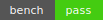

# Watcher



Atelier local d'IA de programmation autonome (offline par défaut).
Mémoire vectorielle, curriculum adaptatif, A/B + bench et quality gate sécurité.

## Documentation

La documentation technique est générée avec [MkDocs Material](https://squidfunk.github.io/mkdocs-material/)
et déployée automatiquement via GitHub Pages : https://<github-username>.github.io/Watcher/.
Activez GitHub Pages dans les paramètres du dépôt (source : **GitHub Actions**) pour autoriser le workflow
`deploy-docs.yml` à publier le site.

Pour la prévisualiser localement :

```bash
pip install -r requirements-dev.txt
mkdocs serve
```

Le workflow GitHub Actions [`deploy-docs.yml`](.github/workflows/deploy-docs.yml) construit le site avec `mkdocs build --strict`
avant de le publier sur l'environnement **GitHub Pages** à chaque push sur `main`.

## Releases, SBOM et provenance

Chaque tag SemVer (`vMAJOR.MINOR.PATCH`) déclenche le workflow [`release.yml`](.github/workflows/release.yml) qui produit
un installeur Windows signé, un SBOM CycloneDX et une attestation de provenance SLSA niveau 3.

- `Watcher-Setup.zip` : archive contenant l'installeur généré par PyInstaller.
- `Watcher-Setup.zip.sigstore` : bundle Sigstore pour vérifier la signature du binaire (`sigstore verify identity --bundle ...`).
- `Watcher-sbom.json` : inventaire CycloneDX des dépendances Python installées lors du build (`cyclonedx-bom` / `cyclonedx-py`).
- `Watcher-Setup.intoto.jsonl` : provenance SLSA générée par [`slsa-github-generator`](https://github.com/slsa-framework/slsa-github-generator).

Ces fichiers sont publiés en tant qu'artefacts de release. Téléchargez le SBOM pour auditer les composants et la provenance
`*.intoto.jsonl` pour tracer la chaîne de build ou alimenter un vérificateur SLSA.

### Installer l'installeur Windows signé

1. Téléchargez `Watcher-Setup.zip` ainsi que `Watcher-Setup.zip.sigstore` depuis la page GitHub Releases
   correspondant au tag SemVer (`vMAJOR.MINOR.PATCH`) que vous souhaitez déployer.
2. Installez le CLI [Sigstore](https://www.sigstore.dev/) si nécessaire :

   ```bash
   pip install sigstore
   ```

3. Vérifiez la signature à l'aide du bundle publié par le workflow `release.yml` :

   ```powershell
   sigstore verify identity `
     --bundle Watcher-Setup.zip.sigstore `
     --certificate-identity "https://github.com/<owner>/Watcher/.github/workflows/release.yml@refs/tags/<tag>" `
     --certificate-oidc-issuer https://token.actions.githubusercontent.com `
     Watcher-Setup.zip
   ```

   Remplacez `<owner>` par l'organisation ou l'utilisateur GitHub hébergeant ce dépôt et `<tag>` par la version téléchargée.
   La commande échoue si la signature ne provient pas du workflow officiel exécuté sur GitHub Actions.
4. Extrayez l'archive (clic droit → *Extraire tout...* ou `Expand-Archive` sous PowerShell) puis lancez `Watcher.exe`.
   Conservez le dossier d'extraction tel quel : il contient la configuration (`config/`), les prompts LLM et les fichiers
   auxiliaires (`LICENSE`, `example.env`) nécessaires à l'exécutable.

Le bundle Sigstore fournit également un horodatage de transparence et peut être vérifié hors-ligne grâce au
[`rekor-cli`](https://github.com/sigstore/rekor) si vous devez archiver la preuve de signature.

## Benchmarks

Le script `python -m app.core.benchmark run` exécute quatre scénarios
représentatifs en mesurant le temps et l'utilisation mémoire via `tracemalloc` :

- `planner_briefing` : génère des briefs successifs avec le planificateur.
- `learner_update` : applique plusieurs mises à jour du `Learner`.
- `metrics_tracking` : exerce les context managers de `PerformanceMetrics`.
- `memory_operations` : manipule la base SQLite de `Memory` (ajout, résumé,
  feedback et recherche vectorielle).

Chaque exécution ajoute une entrée historique dans `metrics/benchmarks.jsonl`,
met à jour le résumé courant dans `metrics/benchmarks-latest.json` et régénère
le badge `metrics/performance_badge.svg`.

Les seuils de non-régression sont définis dans `metrics/bench_thresholds.json`.
Pour vérifier qu'ils sont respectés, utilisez :

```bash
python -m app.core.benchmark run --samples 5 --warmup 1
python -m app.core.benchmark check --update-badge
```

La CI (`ci.yml`) exécute automatiquement ces commandes et échoue si un scénario
dépasse l'un des seuils configurés.

## Gestion des données avec DVC

Watcher versionne ses jeux de données légers avec [DVC](https://dvc.org/).
Installez l'outil (par exemple `pip install "dvc[s3]"`) avant d'exécuter les commandes ci-dessous.

- L'étape `prepare-data` lit `datasets/raw/simple_linear.csv` et génère
  `datasets/processed/simple_linear.csv` en appliquant les hyperparamètres
  définis dans `params.yaml` (`prepare.sample_size`, `prepare.random_seed`).
- L'étape `validate-data` exécute trois scripts (`scripts/validate_schema.py`,
  `scripts/validate_size.py`, `scripts/validate_hash.py`) pour vérifier la
  structure, la taille et l'empreinte MD5 du fichier préparé. Les attentes sont
  décrites dans la section `validate.simple_linear` de `params.yaml`.

Pour régénérer et valider les données locales :

```bash
dvc repro
```

Le dépôt est configuré avec un remote S3 `storage` pointant vers
`s3://watcher-artifacts` (voir `.dvc/config`). Pour publier ou récupérer les
artefacts :

1. Configurer vos identifiants AWS via `aws configure` ou en définissant les
   variables d'environnement `AWS_ACCESS_KEY_ID`, `AWS_SECRET_ACCESS_KEY` et
   `AWS_DEFAULT_REGION`.
2. Initialiser la cible par défaut si nécessaire :

   ```bash
   dvc remote default storage
   ```

3. Synchroniser les données :

   ```bash
   dvc push   # envoie les artefacts locaux vers S3
   dvc pull   # récupère les artefacts manquants depuis S3
   ```

Si vous devez utiliser un autre fournisseur (Azure Blob Storage, Google Cloud,
etc.), ajustez l'URL du remote via `dvc remote modify storage url <nouvelle-url>`
et mettez à jour la configuration d'authentification associée.

## Installation

1. Cloner ce dépôt.
2. Créer et activer un environnement Python 3.12 :

   ```bash
   python -m venv .venv
   source .venv/bin/activate  # Linux/macOS
   .venv\Scripts\activate   # Windows
   ```

3. Installer les dépendances :

   ```bash
   pip install -r requirements.txt
   ```

   Pour activer les quotas d'exécution sur Windows, installez
   également la dépendance optionnelle `pywin32` :

   ```bash
   pip install pywin32  # facultatif
   ```

4. Installer les outils de développement :

    ```bash
    pip install -r requirements-dev.txt
    ```

    Ce fichier fixe des versions précises afin d'assurer une installation reproductible.

    Sur Windows, le script `installer.ps1` installe automatiquement toutes ces dépendances.

Les fichiers d'environnement (`*.env`), les journaux (`*.log`) et les environnements virtuels (`.venv/`) sont ignorés par Git afin d'éviter la mise en version de données sensibles ou temporaires.

## Environnement de développement

Un dossier `.devcontainer/` est fourni pour disposer d'un environnement prêt à l'emploi
dans VS Code ou GitHub Codespaces. Il utilise l'image Python 3.12 officielle,
préconfigure les caches `pip` et `DVC` sur des volumes persistants et installe
automatiquement les dépendances du projet ainsi que les hooks `pre-commit`.

Pour ouvrir le projet dans un devcontainer :

1. Installer l'extension [Dev Containers](https://marketplace.visualstudio.com/items?itemName=ms-vscode-remote.remote-containers).
2. Dans VS Code, exécuter la commande **Dev Containers: Reopen in Container**.
3. Attendre la fin du script `.devcontainer/post-create.sh` qui prépare l'environnement.

Les caches partagés accélèrent notamment les installations pip et la synchronisation DVC
entre plusieurs sessions Codespaces.

## Compatibilité NumPy

Watcher tente d'utiliser la bibliothèque `numpy` lorsqu'elle est disponible.
Si son import échoue, un module de repli léger `numpy_stub` est utilisé à la
place. Les modules Python importent donc `np` via `from app.utils import np`
pour bénéficier automatiquement de ce mécanisme.

## Mémoire et migrations

Le module `Memory` s'appuie sur SQLite et exécute automatiquement les
migrations [Alembic](https://alembic.sqlalchemy.org/) au démarrage pour garantir
la présence du schéma attendu. Chaque connexion active `journal_mode=WAL`,
`foreign_keys=ON`, `busy_timeout=5000`, `secure_delete=ON` et tente d'exposer
FTS5 lorsque la compilation de SQLite le permet.

### Activer le chiffrement SQLCipher

Watcher détecte automatiquement la prise en charge de
[SQLCipher](https://www.zetetic.net/sqlcipher/). Lorsque le binaire `sqlite3`
est compilé avec cette extension, vous pouvez chiffrer la base mémoire en
définissant les variables d'environnement suivantes avant de lancer
l'application :

```bash
export WATCHER_MEMORY_ENABLE_SQLCIPHER=1
export WATCHER_MEMORY_SQLCIPHER_PASSWORD="motdepasse-solide"
```

Si SQLCipher n'est pas détecté ou si le mot de passe est absent, Watcher
revient automatiquement à un stockage non chiffré et inscrit un avertissement
dans les journaux pour faciliter le diagnostic.

## Utilisation

### Interface graphique

Sous Windows :

1. `./installer.ps1 -SkipOllama` pour installer l'environnement local sans télécharger les modèles Ollama.
   Omettez l'option `-SkipOllama` pour déclencher l'installation complète lorsque vous avez besoin des modèles.
2. `./run.ps1`

Dans un environnement sans serveur d'affichage (CI, sessions distantes), forcez le mode headless en vidant `DISPLAY`
avant d'exécuter le lanceur :

```powershell
$env:DISPLAY = ""
./run.ps1
```

### Ligne de commande

```bash
python -m app.ui.main
```

### Générer une CLI Python

Un utilitaire `create_python_cli` (dans `app.tools.scaffold`) permet de
générer un squelette de projet sous `app/projects/<nom>`. Passer
`force=True` écrase les fichiers existants sans demande de confirmation.

## Plugins

Watcher peut être étendu par des plugins implémentant l'interface
`Plugin` définie dans `app/tools/plugins`. Chaque plugin expose un
attribut `name` ainsi qu'une méthode `run()` retournant un message à
l'utilisateur.

Deux mécanismes de découverte sont supportés :

- déclaration explicite dans le fichier `plugins.toml` ;
- [entry points](https://packaging.python.org/en/latest/specifications/entry-points/)
  Python via le groupe `watcher.plugins` recherchés par
  `discover_entry_point_plugins()`.

Pour enregistrer un plugin via les entry points dans un projet
emballé, ajoutez par exemple dans votre `pyproject.toml` :

```toml
[project.entry-points."watcher.plugins"]
hello = "monpaquet.monmodule:MonPlugin"
```

Un exemple minimal est fourni dans `app/tools/plugins/hello.py`.

## Tests & Qualité

Watcher s'appuie désormais sur [Nox](https://nox.thea.codes/) pour unifier les
linters, l'analyse statique, les tests et la construction du package :

```bash
nox -s lint typecheck security tests
```

Les sessions peuvent également être exécutées individuellement (`nox -s lint`,
`nox -s tests`, etc.) et une étape `nox -s build` génère les artefacts wheel et
sdist.

Pour automatiser les corrections, la cible `make format` applique Ruff (lint
et formattage) puis Black, et `make check` délègue dorénavant à Nox.

### Hooks pre-commit

Le dépôt inclut une configuration `pre-commit` regroupant les hooks suivants :

* Ruff (`ruff` et `ruff-format`) pour le linting et le formatage.
* Black pour garantir un style Python cohérent.
* mypy (avec `types-requests`) pour la vérification de types statique.
* Bandit pour l'analyse de sécurité.
* Semgrep basé sur `config/semgrep.yml`.
* Codespell pour détecter les fautes de frappe courantes.
* `end-of-file-fixer` qui s'assure que chaque fichier texte se termine par une
  nouvelle ligne.
Après avoir installé les dépendances de
développement, activez les hooks localement :

```bash
pre-commit install
```

Vous pouvez ensuite valider l'ensemble des fichiers :

```bash
pre-commit run --all-files
```

La configuration `bandit.yml` exclut notamment les répertoires `.git`, `datasets`,
`.venv`, `build`, `dist` et `*.egg-info` afin d'éviter l'analyse de contenus
non pertinents.

## Gouvernance des contributions

- Les formulaires présents dans `.github/ISSUE_TEMPLATE/` ajoutent
  systématiquement `status:needs-triage` ainsi qu'un label `type:*`
  (`type:bug`, `type:feature`, `type:discussion`).
- Le fichier `.github/CODEOWNERS` assigne les revues aux équipes responsables.
  Adaptez les alias (`@WatcherOrg/...`) à votre organisation GitHub.
- Avant toute fusion, assurez-vous que `nox -s lint typecheck security tests
  build` est vert sur la CI et qu'au moins un CODEOWNER a approuvé la PR. Un
  mainteneur peut ensuite poser `status:ready-to-merge` qui déclenchera la
  fusion automatique.

Pour plus de détails (priorités, gestion du label `blocked`, etc.), consultez
`docs/merge-policy.md`.

## Reproductibilité

Un utilitaire `set_seed` permet de fixer la graine aléatoire pour Python,
NumPy et, si disponible, PyTorch. Le fichier de configuration
`config/settings.toml` contient un paramètre `seed` dans la section `[training]`
qui peut être adapté pour garantir des exécutions déterministes.

La commande CLI `watcher` lit cette graine au démarrage (ou l'option
`--seed`) puis appelle `set_seed` avant de déléguer aux sous-commandes.
Cela initialise toutes les bibliothèques stochastiques et met à jour les
variables d'environnement `PYTHONHASHSEED` et `WATCHER_TRAINING__SEED` pour que
les sous-processus héritent de la configuration.

La chaîne d'outils reproduit le même comportement :

- la CI exporte `PYTHONHASHSEED=42`, `WATCHER_TRAINING__SEED=42`,
  `CUBLAS_WORKSPACE_CONFIG=:4096:8` et `TORCH_DETERMINISTIC=1` ;
- le `Makefile` et le script PowerShell `run.ps1` propagent ces variables
  (avec une graine configurable via `SEED`/`WATCHER_TRAINING__SEED`).

Pour vos exécutions locales, vous pouvez soit utiliser le `Makefile`
(`make check`, `make nox`, …), soit exporter explicitement les variables
précitées avant de lancer vos scripts afin d'aligner l'environnement avec
la configuration versionnée.

## Données

La pipeline [DVC](https://dvc.org/) décrite dans `dvc.yaml` prépare et valide le
jeu de données linéaire utilisé par `train.py` :

- `prepare-data` lit `datasets/raw/simple_linear.csv`, applique les paramètres
  définis dans `params.yaml` (graine, taille d'échantillon) et génère
  `datasets/processed/simple_linear.csv`.
- `validate-data` utilise `foreach` pour produire trois sous-étapes
  (`validate-data@schema`, `validate-data@size`, `validate-data@hash`).
  Chacune exécute un script dédié dans `scripts/validate_*.py` pour
  vérifier respectivement le schéma, la taille et le hachage du fichier
  produit.

Les hyperparamètres d'entraînement ainsi que les contraintes de validation sont
centralisés dans `params.yaml` (syntaxe JSON valide YAML pour éviter d'ajouter
une dépendance d'analyse). Pour exécuter la pipeline complète et garantir
que les validations passent, lancez :

```bash
dvc repro validate-data
```

Un remote S3 nommé `storage` est configuré dans `.dvc/config` (URL
`s3://watcher-artifacts`). Renseignez vos identifiants AWS via les variables
d'environnement standard (`AWS_ACCESS_KEY_ID`, `AWS_SECRET_ACCESS_KEY`,
éventuellement `AWS_SESSION_TOKEN` ou `AWS_PROFILE`) puis synchronisez les
artefacts DVC avec :

```bash
# envoyer les données préparées sur le bucket
dvc push
# récupérer les dernières versions depuis le stockage
dvc pull
```

Vous pouvez remplacer le bucket par un autre en adaptant la configuration du
remote :

```bash
dvc remote modify storage url s3://votre-bucket
```

Pour cibler un autre fournisseur, créez un remote dédié et rendez-le
par défaut. Exemple avec Azure Blob Storage :

```bash
dvc remote add -d azure azure://mon-container/datasets
dvc remote modify azure connection_string "DefaultEndpointsProtocol=..."
```

Consultez la [documentation DVC](https://dvc.org/doc/command-reference/remote)
pour les paramètres spécifiques (S3, Azure, GCS, etc.).

### Collecte

Un module de scraping asynchrone (`app/data/scraper.py`) permet de
collecter des pages web en parallèle tout en les mettant en cache sur
disque. Les téléchargements déjà effectués ne sont pas relancés, ce qui
accélère les itérations et facilite la reprise après interruption.

## Structure du dépôt

- `app/` : moteur principal, mémoire, benchmarks et interface utilisateur.
- `datasets/` : jeux d'entraînement Python (`fib`, `fizzbuzz`, `is_prime`).
- `config/` : paramètres et règles de sécurité (`semgrep`).

## Sécurité

Sandbox d'exécution confinée, tests et linters obligatoires avant adoption de code.
Semgrep utilise un fichier de règles local (`config/semgrep.yml`), aucun accès réseau requis.

## Confidentialité

Watcher fonctionne hors ligne par défaut et n'envoie aucune donnée vers l'extérieur.
Les journaux comme les contenus mémorisés restent sur l'environnement local et peuvent être effacés par l'utilisateur.

## Configuration des logs

Watcher peut charger une configuration de journalisation personnalisée depuis un fichier YAML **ou** JSON. Définissez la
variable d'environnement `LOGGING_CONFIG_PATH` pour indiquer le chemin du fichier :

```bash
# YAML par défaut
export LOGGING_CONFIG_PATH=./config/logging.yml

# Variante JSON équivalente
export LOGGING_CONFIG_PATH=./config/logging.json
```

Les deux fichiers décrivent un pipeline avec un formatter JSON et un filtre de contexte (`RequestIdFilter`) capable d'injecter les
identifiants de requête et de trace, ainsi qu'un filtre d'échantillonnage (`SamplingFilter`). Adaptez le paramètre `sample_rate`
pour contrôler la proportion de messages conservés :

```yaml
filters:
  sampling:
    (): app.core.logging_setup.SamplingFilter
    sample_rate: 0.1  # ne journalise qu'environ 10 % des messages
```

Les clés `request_id_field`, `trace_id_field` et `sample_rate_field` peuvent être
personnalisées dans les fichiers YAML/JSON afin d'aligner les noms de colonnes
avec vos outils d'observabilité. Le module `app.core.logging_setup` expose
également `set_trace_context(trace_id, sample_rate)` pour propager dynamiquement
ces valeurs dans les journaux structurés.

Si `LOGGING_CONFIG_PATH` est absent ou que le fichier fourni est introuvable, le fichier `config/logging.yml` inclus dans le
projet est utilisé. En dernier recours, Watcher applique la configuration basique de Python (`logging.basicConfig`) avec le
niveau `INFO`.

## Éthique et traçabilité

Les actions du système sont journalisées via le module standard `logging`. Les erreurs et décisions importantes sont ainsi consignées pour audit ou débogage.

Les contenus générés peuvent être conservés dans une base SQLite par le composant de mémoire (`app/core/memory.py`). Cette base stocke textes et métadonnées afin d'offrir un historique local des opérations.

Pour un aperçu détaillé des principes éthiques et des limites d'utilisation, consultez [ETHICS.md](ETHICS.md).

