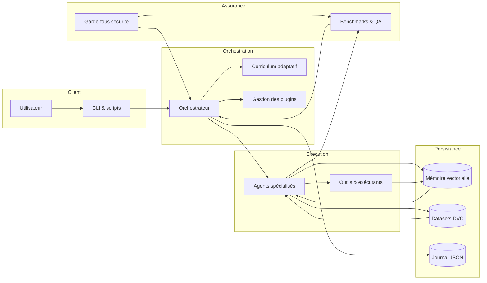
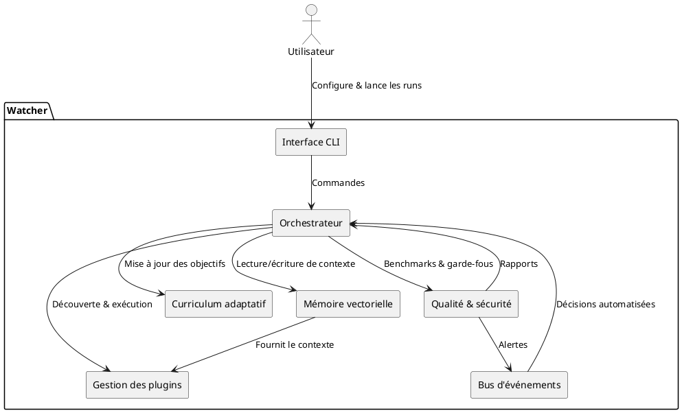
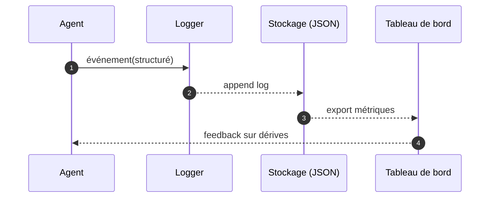

# Architecture

Watcher orchestre plusieurs briques spécialisées pour fournir un atelier d'IA local, sûr et traçable. Cette page
présente les responsabilités de chaque composant et illustre les principaux échanges via des diagrammes Mermaid et
PlantUML intégrés à la documentation.

## Vue générale

- **Interface utilisateur** : scripts CLI (`python -m app.ui.main`) et automatisations (`run.ps1`) qui déclenchent les
  scénarios d'entraînement ou d'évaluation.
- **Orchestrateur** : modules `app.core` responsables de la planification des tâches, de l'exécution des agents et du
  pilotage du curriculum adaptatif.
- **Agents et outils** : classes sous `app.agents` et `app.tools` chargées de la génération de code, de l'analyse et de la
  rétroaction utilisateur.
- **Mémoire vectorielle** : stockage persistant des connaissances et contextes dans `app.core.memory`.
- **Qualité et sécurité** : bancs d'essai (`tests/`, `metrics/`, `QA.md`) et garde-fous (`bandit.yml`, `pyproject.toml`).
- **Journalisation** : configuration centralisée via `app.core.logging_setup` pour tracer toutes les décisions et actions.

## Diagramme d'ensemble (Mermaid)

Le diagramme met en évidence la boucle de rétroaction : les agents consultent la mémoire vectorielle, exécutent des
outils puis alimentent les bancs d'essai et les journaux. Les résultats réinjectés dans l'orchestrateur lui permettent
d'affiner la stratégie d'entraînement.

## Interactions détaillées (PlantUML)

Cette vue composant détaille les principaux flux applicatifs et souligne l'importance de la modularité : chaque brique
peut être remplacée ou étendue sans casser la chaîne de valeur si les interfaces documentées sont respectées.

## Chaîne d'observabilité

Cette séquence illustre comment les événements structurés alimentent la surveillance. La journalisation JSON autorise
l'export vers des tableaux de bord tout en conservant la traçabilité locale.

## Points d'extension

- **Plugins** : `plugins.toml` et les entry points `watcher.plugins` permettent d'ajouter des capacités sans modifier le
  noyau.
- **Pipelines de qualité** : de nouveaux scénarios peuvent être ajoutés dans `tests/` ou `metrics/` pour renforcer les
  contrôles.
- **Sources de données** : les ensembles DVC sous `datasets/` peuvent être étendus avec de nouveaux corpus tout en
  conservant la reproductibilité.
