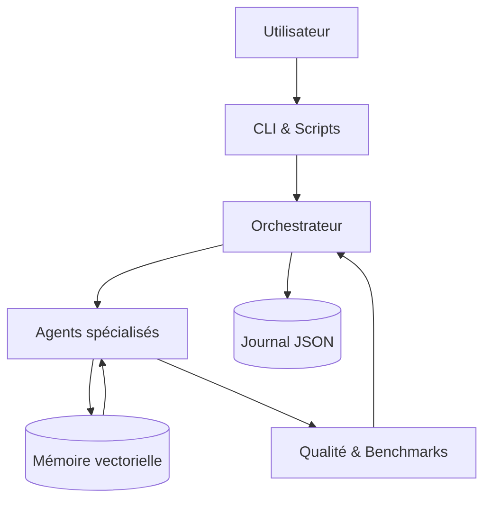
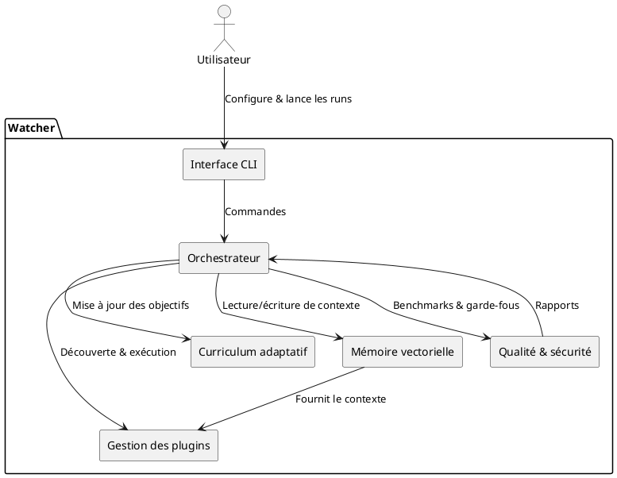

# Architecture

Watcher orchestre plusieurs composants pour fournir un atelier d'IA local, sûr et traçable.
Cette page résume leurs responsabilités et les interactions majeures.

## Composants principaux

- **Interface utilisateur** : scripts CLI (`python -m app.ui.main`) et automatisations (`run.ps1`) qui
  déclenchent les scénarios d'entraînement ou d'évaluation.
- **Orchestrateur** : modules `app.core` qui planifient les tâches, exécutent les agents et pilotent
  le curriculum adaptatif.
- **Agents et outils** : classes sous `app.agents` et `app.tools` responsables de la génération de code,
  de l'analyse et de la rétroaction utilisateur.
- **Mémoire vectorielle** : stockage persistant des connaissances et contextes dans `app.core.memory`.
- **Qualité et sécurité** : bancs d'essai (`tests/`, `metrics/`, `QA.md`) et garde-fous (`bandit.yml`,
  `pyproject.toml` pour les linters et hooks).
- **Journalisation** : configuration centralisée via `app.core.logging_setup` pour tracer toutes les
  décisions et actions.

## Vue globale

La figure met en évidence la boucle de rétroaction : les agents consultent la mémoire vectorielle,
exécutent des outils, puis alimentent les bancs d'essai et les journaux. Les résultats réinjectés dans
l'orchestrateur lui permettent d'affiner la stratégie d'entraînement.

## Interactions détaillées

Ces interactions soulignent l'importance de la modularité : chaque composant peut être remplacé ou étendu
sans casser la chaîne de valeur à condition de respecter les interfaces documentées.

## Points d'extension

- **Plugins** : `plugins.toml` et les entry points `watcher.plugins` permettent d'ajouter des capacités sans
  modifier le noyau.
- **Pipelines de qualité** : de nouveaux scénarios peuvent être ajoutés dans `tests/` ou `metrics/` pour
  renforcer les contrôles.
- **Sources de données** : les ensembles DVC sous `datasets/` peuvent être étendus avec de nouveaux corpus
  tout en conservant la reproductibilité.
