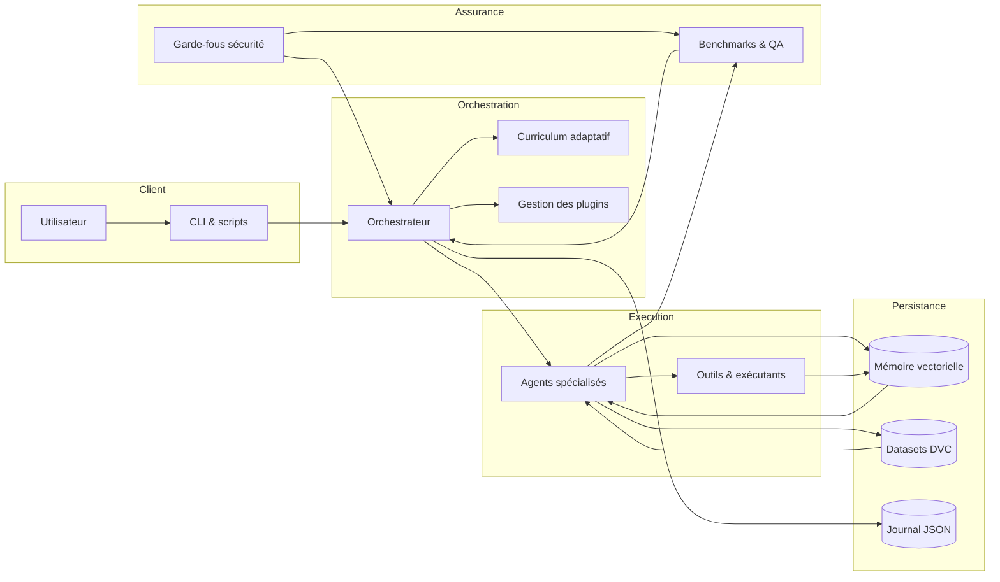
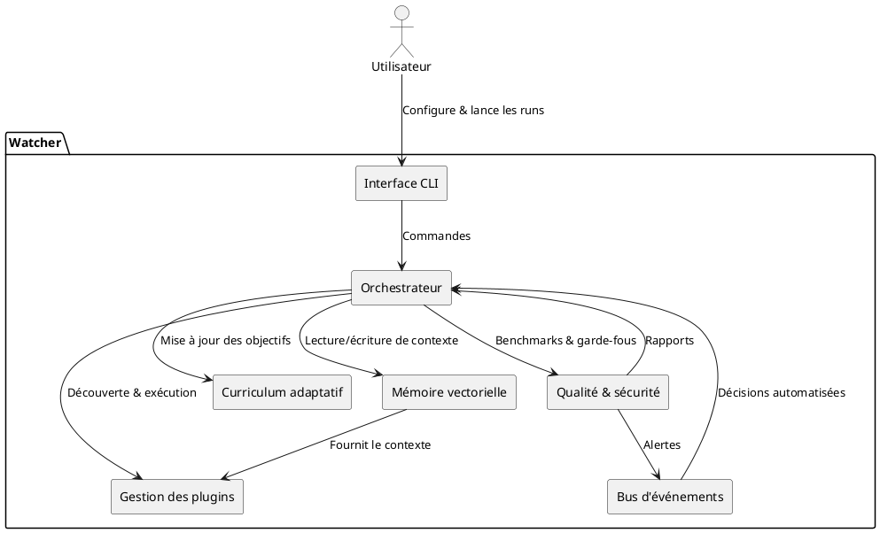
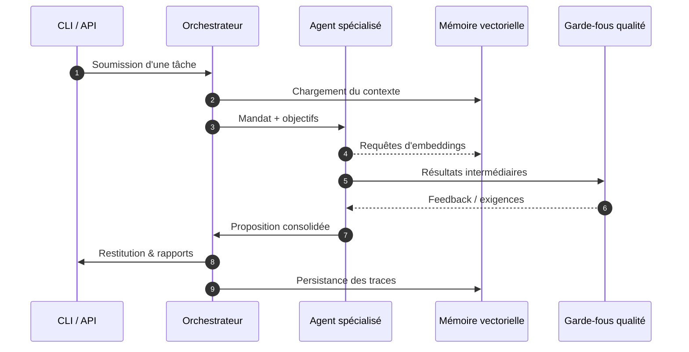
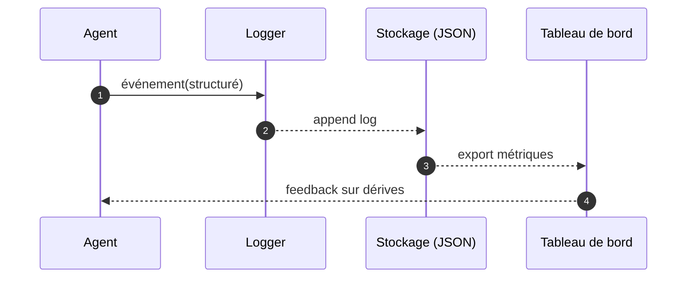

# Architecture

Watcher orchestre plusieurs composants pour fournir un atelier d'IA local, sûr et traçable.
Cette page résume leurs responsabilités, leurs interactions et les points d'extension.

!!! info "Configurations clés"
    Les paramètres globaux proviennent de `config/` et des variables d'environnement consommées par
    `app.configuration`. Ils alimentent l'orchestrateur au démarrage pour activer ou non certaines
    capacités (sandbox, outils externes, limites d'exécution, etc.).

## Composants principaux

- **Interface utilisateur** : scripts CLI (`python -m app.ui.main`) et automatisations (`run.ps1`,
  `automation-playbook.sh`) qui déclenchent les scénarios d'entraînement ou d'évaluation.
- **Orchestrateur** : modules `app.core` (planner, learner, pipeline) qui planifient les tâches,
  orchestrent les agents et pilotent le curriculum adaptatif.
- **Agents et outils** : classes sous `app.agents`, `app.tools` et `app.llm` responsables de la
  génération de code, de l'analyse et de la rétroaction utilisateur.
- **Mémoire vectorielle** : stockage persistant des connaissances et contextes dans
  `app.core.memory` appuyé sur SQLite/SQLCipher.
- **Qualité et sécurité** : bancs d'essai (`tests/`, `metrics/`, `QA.md`) et garde-fous (`bandit.yml`,
  `pyproject.toml`, `noxfile.py`) exécutés via CI.
- **Journalisation** : configuration centralisée via `app.core.logging_setup` et conventions détaillées dans
  `docs/logging.md`.

## Cartographie des couches

| Couche | Rôle | Modules clés | Artefacts associés |
| --- | --- | --- | --- |
| Interface & déclencheurs | Prendre les entrées utilisateurs et exposer les scénarios. | `app.cli`, `app.ui`, `run.ps1` | `README.md`, `automation-playbook.sh` |
| Orchestration & raisonnement | Distribuer les tâches, piloter les agents, gérer les itérations. | `app.core.planner`, `app.core.engine`, `app.core.pipeline` | `config/`, `params.yaml` |
| Exécution agents | Implémenter les stratégies spécialisées (autograder, evaluator, critic). | `app.agents`, `app.core.autograder`, `app.core.critic` | `datasets/`, `plugins.toml` |
| Mémoire & données | Conserver le contexte vectoriel, indexer les runs, charger les embeddings. | `app.core.memory`, `app.embeddings`, `app.data` | `metrics/`, `alembic/` |
| Assurance & sécurité | Valider les sorties, imposer des garde-fous, orchestrer les audits. | `tests/`, `noxfile.py`, `bandit.yml`, `QA.md` | `docs/threat-model.md`, `docs/ethics.md` |

Cette vue synthétique permet d'identifier rapidement où intégrer un nouvel outil ou une nouvelle
politique de contrôle.

## Vue globale

La figure met en évidence la boucle de rétroaction : les agents consultent la mémoire vectorielle,
exécutent des outils, puis alimentent les bancs d'essai et les journaux. Les résultats réinjectés dans
l'orchestrateur lui permettent d'affiner la stratégie d'entraînement.

## Interactions détaillées

Ces interactions soulignent l'importance de la modularité : chaque composant peut être remplacé ou étendu
sans casser la chaîne de valeur à condition de respecter les interfaces documentées.

## Cycle d'une exécution type

Ce scénario illustre la boucle de rétroaction : les agents s'appuient sur la mémoire vectorielle pour
produire une solution, la font valider par les garde-fous, puis renvoient les résultats à l'orchestrateur.

## Chaîne d'observabilité

Cette séquence illustre comment les événements structurés alimentent la surveillance. La journalisation JSON
autorise l'export vers des tableaux de bord tout en conservant la traçabilité locale.

## Points d'extension

- **Plugins** : `plugins.toml` et les entry points `watcher.plugins` permettent d'ajouter des capacités sans
  modifier le noyau (voir `app.plugins` pour les helpers de découverte).
- **Pipelines de qualité** : de nouveaux scénarios peuvent être ajoutés dans `tests/` ou `metrics/` pour
  renforcer les contrôles automatisés et nourrir le tableau de bord de performances.
- **Sources de données** : les ensembles DVC sous `datasets/` peuvent être étendus avec de nouveaux corpus
  tout en conservant la reproductibilité.
- **Instrumentation** : les handlers définis dans `app.core.logging_setup` acceptent des destinations
  supplémentaires (fichiers, flux réseau) tant que le format JSON structuré est conservé.
