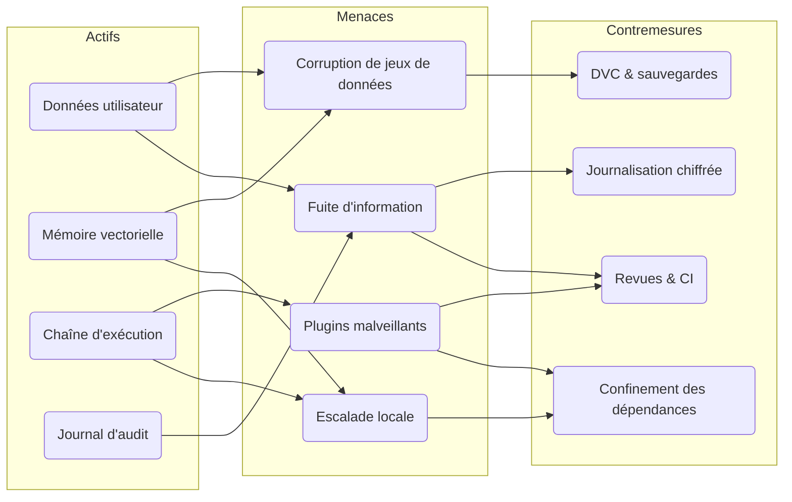
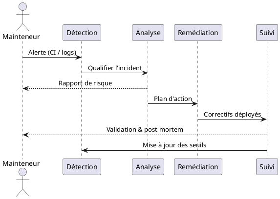

# Modèle de menaces

Cette analyse synthétise les actifs critiques de Watcher, les vecteurs d'attaque plausibles et les contrôles
opérationnels disponibles. Elle complète la charte publiée dans [ETHICS.md](ethics.md) et s'appuie sur les diagrammes
Mermaid/PlantUML rendus nativement par MkDocs Material.

## Actifs protégés

| Actif | Description | Priorité |
| --- | --- | --- |
| Données utilisateur | Projets, journaux, ensembles DVC stockés localement. | Élevée |
| Mémoire vectorielle | Représentations persistantes des apprentissages agents. | Élevée |
| Chaîne d'exécution | Scripts Python, plugins et automatisations. | Moyenne |
| Journal d'audit | Traces JSON (`watcher.log`) et historiques d'évaluations. | Moyenne |

## Cartographie des risques (Mermaid)

Ce diagramme relie chaque actif aux principaux vecteurs d'attaque puis aux contrôles mis en place. Il sert de référence
rapide pour vérifier que chaque risque bénéficie d'au moins une mitigation.

## Surfaces d'attaque

1. **Plugins malveillants** : injection de code via `plugins.toml` ou entry points.
2. **Manipulation de jeux de données** : corruption d'artefacts DVC ou de la mémoire vectorielle.
3. **Fuite d'informations** : export ou transmission involontaire de journaux sensibles.
4. **Escalade locale** : exploitation d'un script d'automatisation ou d'un outil externe mal configuré.

## Mesures de mitigation

- **Isolation des dépendances** : environnements virtuels (`.venv/`) et contrôle des versions via `requirements*.txt`.
- **Revue de code** : hooks `pre-commit`, linting (Ruff), analyse statique (mypy) et audits de sécurité (Bandit, Semgrep)
  exécutés par Nox et la CI.
- **Surveillance** : journalisation JSON centralisée et rotation configurable pour tracer chaque action.
- **Gouvernance des données** : DVC impose un suivi précis des jeux de données et facilite les vérifications d'intégrité.
- **Contrôles utilisateurs** : la charte [ETHICS.md](ethics.md) rappelle les bonnes pratiques de gestion des retours et des
  données sensibles.

## Réponse à incident (PlantUML)

Cette séquence illustre la boucle de réponse opérationnelle : les journaux déclenchent la détection, l'analyse évalue
l'impact, la remédiation applique les correctifs puis le suivi ajuste la surveillance pour éviter la récurrence.

## Recommandations opérationnelles

!!! warning "Limiter la surface réseau"
    Le projet est conçu pour fonctionner hors ligne. Désactiver ou auditer toute communication externe ajoutée par des
    plugins tiers.

!!! note "Scénarios d'incident"
    - Maintenir des sauvegardes chiffrées de la mémoire vectorielle et des datasets.
    - Documenter les procédures de révocation de plugins douteux.
    - Consigner les analyses post-mortem dans `docs/journal/` pour capitaliser sur les retours d'expérience.
